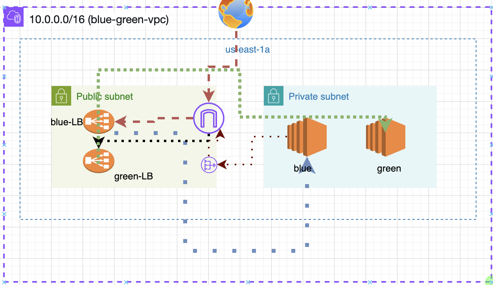
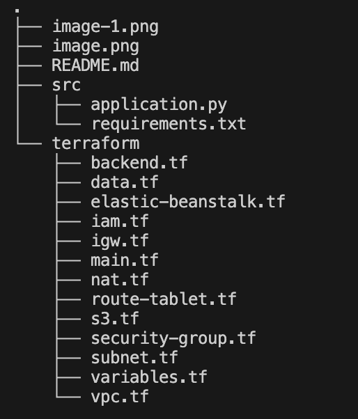
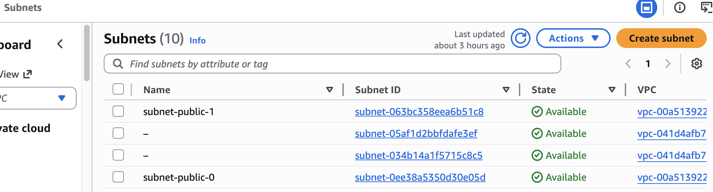
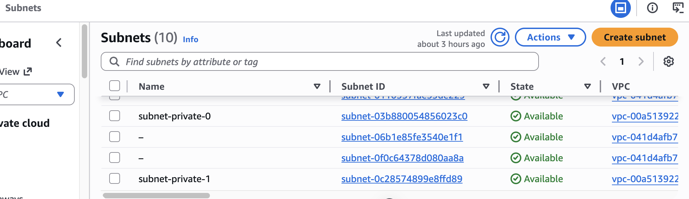
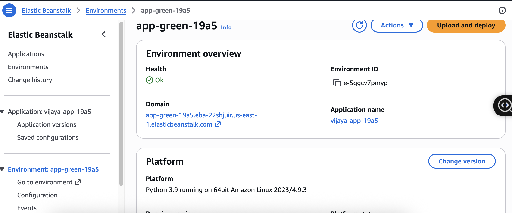
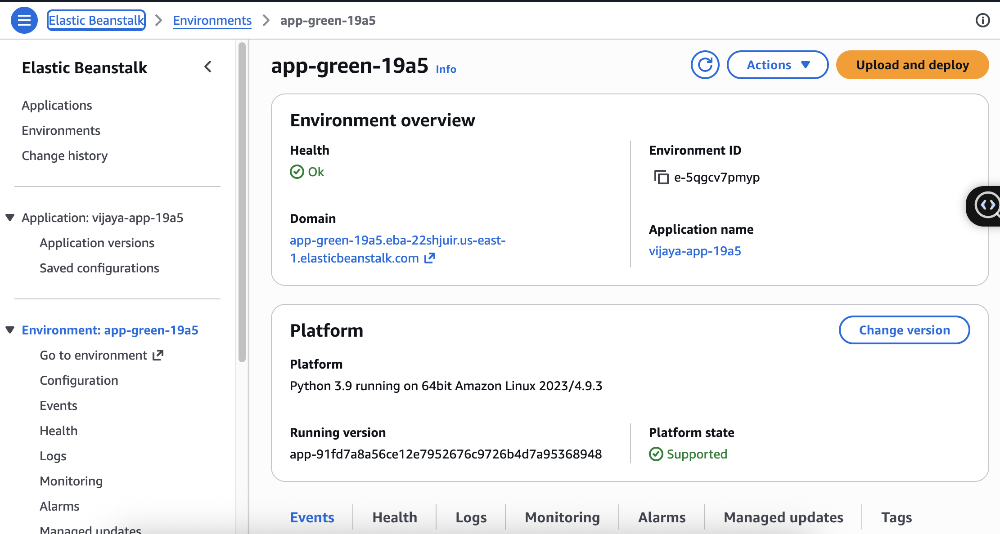
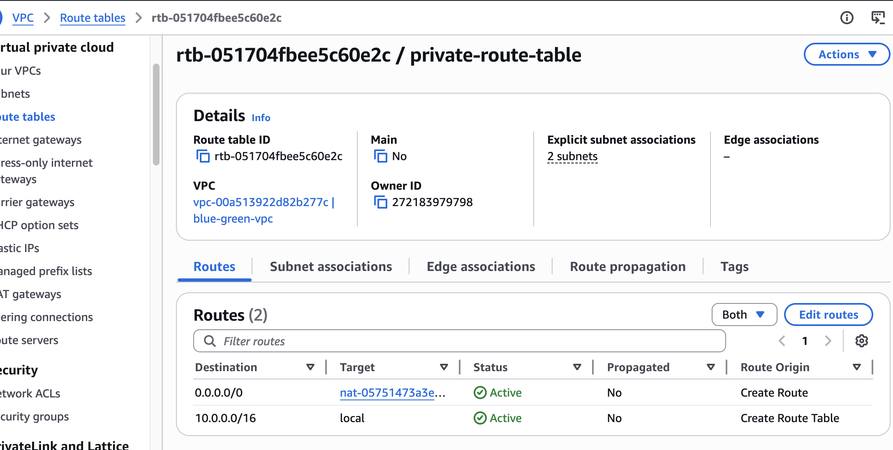
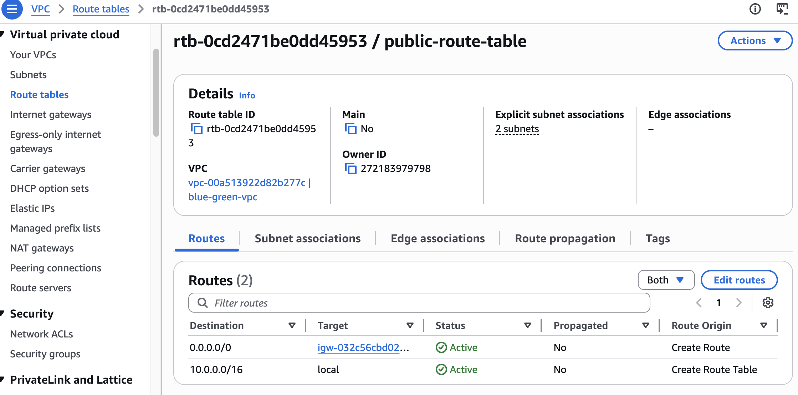
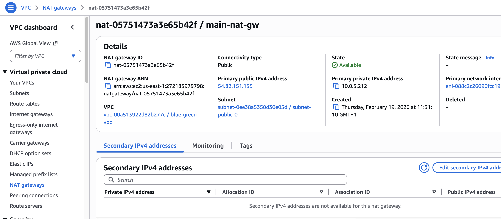
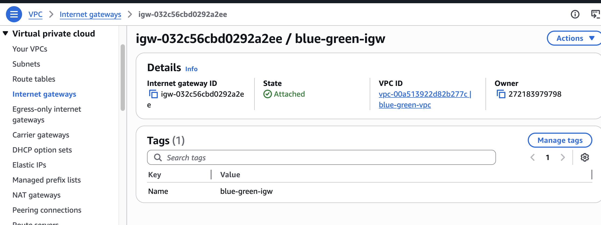

### AWS Elastic Beanstalk Blue/Green Infrastructure
This project contains a Terraform configuration for a highly available, secure web application environment using AWS Elastic Beanstalk. It implements a Blue/Green deployment strategy within a custom VPC.

## Architecture Overview
The infrastructure is designed for security and high availability across two Availability Zones ($us-east-1a$ and $us-east-1b$).
   - **Public Subnets**: Host the Application Load Balancers (ALB), NAT Gateway, and Internet Gateway.
   - **Private Subnets**: Host the EC2 Instances running the Python application. These instances have no public IPs and are inaccessible from the internet.
   - **NAT Gateway**: Provides the private instances with outbound-only internet access for updates and CloudWatch log streaming.
   - **Blue/Green** Setup: Two identical Elastic Beanstalk environments (Blue and Green) each with their own dedicated Load Balancer.
## Blue/Green Deployment Workflow
To update the application without downtime:
   - **Deploy to Green**: Update the app_version in Terraform and apply it to the Green environment.

   - **Verify**: Access the Green environment via its unique Beanstalk URL to ensure the new version is stable.

   - **Swap**: Use the Elastic Beanstalk "Swap Environment URLs" feature in the AWS Console or CLI.

   Note: DNS propagation usually takes 1–2 minutes.

   - **Decommission**: Once verified, the old Blue environment can be terminated or kept as a rollback target.   

# Security & Monitoring
## Security Groups:
   - **Load Balancer SG**: Allows Inbound HTTP (Port 80) from 0.0.0.0/0.

   - **Instance SG**: Only allows Inbound traffic from the Load Balancer Security Group.   

    


The above image is the Architecture of this project for a single AZ in project I implemented for two AZ but represented single AZ in picture for simplicity.

## Project Structure:



### main.tf
``` hcl
provider "aws" {
  region = "us-east-1"
}

resource "random_id" "suffix" {
  byte_length = 2
}


resource "aws_eip" "nat" {
    domain = "vpc"
    depends_on = [aws_internet_gateway.igw]
    tags = {Name = "nat-eip"}
}  
``` 

### vpc.tf

``` hcl
resource "aws_vpc" "vpc-green-blue" {
  
  cidr_block       =  var.my_cidr
  instance_tenancy = "default"
  enable_dns_hostnames = true
  enable_dns_support = true

  tags = {
    Name = "blue-green-vpc"
  }
}
``` 
### data.tf

``` hcl
# This tells Terraform to look up your AWS Account details
data "aws_caller_identity" "current" {}
data "aws_availability_zones" "available" {
    state = "available"
}
```
### variables.tf
``` hcl
variable "my_cidr" {
  description = "CIDR block for the VPC"
  default     = "10.0.0.0/16"
}

variable "regions" {
  type        = list(string)
  description = "AWS region to deploy resources"
  default     = ["us-east-1"]
}

variable "private_subnets" {
  type        = list(string)
  description = "List of private subnet CIDR blocks"
  default     = ["10.0.1.0/24", "10.0.2.0/24"]
}

variable "public_subnets" {
  type        = list(string)
  description = "List of public subnet CIDR blocks"
  default     = ["10.0.3.0/24", "10.0.4.0/24"]
}

variable "app_version" {
  description = "The version of app to deploy"
  type        = string
  default     = "v1"
}

variable "azs" {
  type    = list(string)
  default = ["us-east-1a", "us-east-1b"]
}
```
### subnet.tf

``` hcl
resource "aws_subnet" "subnet-blue-green-private" {
  vpc_id     =  aws_vpc.vpc-green-blue.id
  count      = length(var.private_subnets)
  cidr_block =  var.private_subnets[count.index]
  availability_zone = data.aws_availability_zones.available.names[count.index]
  tags = {
    Name = "subnet-private-${count.index}"
  }
}
resource "aws_subnet" "subnet-blue-green-public" {
  vpc_id     =  aws_vpc.vpc-green-blue.id
  count      = length(var.public_subnets)
  cidr_block =  var.public_subnets[count.index]
  map_public_ip_on_launch = true
  availability_zone = data.aws_availability_zones.available.names[count.index]
  tags = {
    Name = "subnet-public-${count.index}"
       }
 }
```




### security-group.tf

``` hcl
# 1. Security Group for the Load Balancer (Public)
resource "aws_security_group" "eb_lb_sg" {
  name        = "eb-lb-sg"
  vpc_id      = aws_vpc.vpc-green-blue.id
  description = "Allows public traffic into the Beanstalk LB"
  ingress {
    from_port   = 80
    to_port     = 80
    protocol    = "tcp"
    cidr_blocks = ["0.0.0.0/0"]
  }

  # Allow all outbound (to reach instances)
  egress {
    from_port   = 0
    to_port     = 0
    protocol    = "-1"
    cidr_blocks = ["0.0.0.0/0"]
  }
}

# 2. Security Group for the EC2 Instances (Private)
resource "aws_security_group" "eb_instance_sg" {
  name        = "eb-instance-sg"
  vpc_id      = aws_vpc.vpc-green-blue.id
  description = "Allows traffic ONLY from the LB"
  ingress {
    from_port   = 80
    to_port     = 80
    protocol    = "tcp"
    security_groups = [aws_security_group.eb_lb_sg.id]
  }

  egress {
    from_port   = 0
    to_port     = 0
    protocol    = "-1"
    cidr_blocks = ["0.0.0.0/0"]
  }
}
``` 
### s3.tf

``` hcl
# Bucket to store application source bundles (.zip files)
resource "aws_s3_bucket" "eb_artifacts" {
  bucket = "vijaya-artifacts-${random_id.suffix.hex}-${data.aws_caller_identity.current.account_id}"   
  tags = {
    Name = "eb-artifacts"
    Environment = "prod"
  } 
  lifecycle {
    ignore_changes  = all
  }
}

#Enable versioning for safety
resource "aws_s3_bucket_versioning" "eb_artifacts_versioning" {
    bucket = aws_s3_bucket.eb_artifacts.id
    versioning_configuration {
      status = "Enabled"
    }
}

#Lifecycle rule to delete old versions after 30 days
resource "aws_s3_bucket_lifecycle_configuration" "eb_artifacts_lifecycle" {
  bucket = aws_s3_bucket.eb_artifacts.id    
  rule {
    id = "archive-old-versions"
    status = "Enabled"
    expiration {
      days = 90
    }
    }
  }
```
### backend.tf

``` hcl
terraform {
    backend "s3" {
        bucket = "vijaya-blue-green-tf"
        region = "us-east-1"
        key = "prod/eb-blue-green.tfstate"
        dynamodb_table = "terraform-lock-table"
      
    }
}
```
### elastic-beanstalk.tf

``` hcl
# 1. The Application Version (Your pipeline uses this)
resource "aws_elastic_beanstalk_application" "app" { # This name must be "app"
  name = "vijaya-app-${random_id.suffix.hex}"
  description = "Production application for blue-green deployment"

  appversion_lifecycle {
    service_role          = aws_iam_role.test_role.arn
    max_count             = 10
    delete_source_from_s3 = false
  }
}

resource "aws_elastic_beanstalk_application_version" "default" {
  name        = var.app_version
  application = aws_elastic_beanstalk_application.app.name
  bucket      = aws_s3_bucket.eb_artifacts.id
  key         = "${var.app_version}.zip"
}

# 2. THE BLUE ENVIRONMENT
resource "aws_elastic_beanstalk_environment" "blue-tf" {
  name                = "app-blue-${random_id.suffix.hex}"
  application         = aws_elastic_beanstalk_application.app.name
  solution_stack_name = "64bit Amazon Linux 2023 v4.9.3 running Python 3.9"

  setting {
    namespace = "aws:autoscaling:launchconfiguration"
    name      = "IamInstanceProfile"
    value     = aws_iam_instance_profile.eb_profile.name # Use the resource, not a string
  }

  # --- NETWORK & SECURITY ---
  setting {
    namespace = "aws:ec2:vpc"
    name      = "VPCId"
    value     = aws_vpc.vpc-green-blue.id
  }

  setting {
    namespace = "aws:ec2:vpc"
    name      = "Subnets"
    value     = join(",", aws_subnet.subnet-blue-green-private[*].id) # PRIVATE for EC2
  }

  setting {
    namespace = "aws:ec2:vpc"
    name      = "ELBSubnets"
    value     = join(",", aws_subnet.subnet-blue-green-public[*].id)  # PUBLIC for Load Balancer
  }

  setting {
    namespace = "aws:elb:loadbalancer" # Correct for Classic LB
    name      = "SecurityGroups"
    value     = aws_security_group.eb_lb_sg.id
  }

  setting {
    namespace = "aws:autoscaling:launchconfiguration"
    name      = "SecurityGroups"
    value     = aws_security_group.eb_instance_sg.id
  }

  # Enable log streaming to CloudWatch
  setting {
    namespace = "aws:elasticbeanstalk:cloudwatch:logs"
    name      = "StreamLogs"
    value     = "true"
  }

  # How long to keep the logs (in days)
  setting {
    namespace = "aws:elasticbeanstalk:cloudwatch:logs"
    name      = "RetentionInDays"
    value     = "7"
  }

  # Health reporting is also useful to see in logs
  setting {
    namespace = "aws:elasticbeanstalk:healthreporting:system"
    name      = "SystemType"
    value     = "enhanced"
  }

}

# 3. THE GREEN ENVIRONMENT (Identical settings, different version)
resource "aws_elastic_beanstalk_environment" "green-tf" {
  name                = "app-green-${random_id.suffix.hex}"
  application         = aws_elastic_beanstalk_application.app.name
  solution_stack_name = "64bit Amazon Linux 2023 v4.9.3 running Python 3.9"
  version_label       = aws_elastic_beanstalk_application_version.default.name

  setting {
    namespace = "aws:autoscaling:launchconfiguration"
    name      = "IamInstanceProfile"
    value     = aws_iam_instance_profile.eb_profile.name
  }

  setting {
    namespace = "aws:ec2:vpc"
    name      = "VPCId"
    value     = aws_vpc.vpc-green-blue.id
  }

  setting {
    namespace = "aws:ec2:vpc"
    name      = "Subnets"
    value     = join(",", aws_subnet.subnet-blue-green-private[*].id)
  }

  setting {
    namespace = "aws:ec2:vpc"
    name      = "ELBSubnets"
    value     = join(",", aws_subnet.subnet-blue-green-public[*].id)
  }

  setting {
    namespace = "aws:elb:loadbalancer"
    name      = "SecurityGroups"
    value     = aws_security_group.eb_lb_sg.id
  }

  setting {
    namespace = "aws:autoscaling:launchconfiguration"
    name      = "SecurityGroups"
    value     = aws_security_group.eb_instance_sg.id
  }

  setting {
    namespace = "aws:ec2:vpc"
    name      = "AssociatePublicIpAddress"
    value     = "false" # Keep them private!
  }

  # Enable log streaming to CloudWatch
  setting {
    namespace = "aws:elasticbeanstalk:cloudwatch:logs"
    name      = "StreamLogs"
    value     = "true"
  }

  # How long to keep the logs (in days)
  setting {
    namespace = "aws:elasticbeanstalk:cloudwatch:logs"
    name      = "RetentionInDays"
    value     = "7"
  }

  # Health reporting is also useful to see in logs
  setting {
    namespace = "aws:elasticbeanstalk:healthreporting:system"
    name      = "SystemType"
    value     = "enhanced"
  }
}
```




### route-table.tf

``` hcl

resource "aws_route_table" "public" {
  vpc_id = aws_vpc.vpc-green-blue.id

  route {
    cidr_block = "0.0.0.0/0"
    gateway_id = aws_internet_gateway.igw.id
  }

  tags = {
    Name = "public-route-table"
  }
}
resource "aws_route_table_association" "public_assoc" {
  count          = length(var.public_subnets)
  subnet_id      = aws_subnet.subnet-blue-green-public[count.index].id
  route_table_id = aws_route_table.public.id
}
# 1. The Route Table for Private Subnets
resource "aws_route_table" "private" {
  vpc_id = aws_vpc.vpc-green-blue.id

  route {
    cidr_block     = "0.0.0.0/0"
    nat_gateway_id = aws_nat_gateway.main.id
  }

  tags = {
    Name = "private-route-table"
  }
}
resource "aws_route_table_association" "private_assoc" {
    count = length(var.private_subnets)
    subnet_id = aws_subnet.subnet-blue-green-private[count.index].id
    route_table_id = aws_route_table.private.id
  
}
```




### nat.tf
``` hcl
resource "aws_nat_gateway" "main" {
    allocation_id = aws_eip.nat.id 
    subnet_id = aws_subnet.subnet-blue-green-public[0].id
    tags = {Name = "main-nat-gw"}
    depends_on = [ aws_internet_gateway.igw ]
  
}
```



### iam.tf

``` hcl
resource "aws_iam_role" "test_role" {
  name = "eb-role-${random_id.suffix.hex}"

  # Terraform's "jsonencode" function converts .
  
  assume_role_policy = jsonencode({
    Version = "2012-10-17"
    Statement = [
      {
        Action = "sts:AssumeRole"
        Effect = "Allow"
        Sid    = ""
        Principal = {
          Service = "ec2.amazonaws.com"
        }
      },
    ]
  })

}
resource "aws_iam_role_policy_attachment" "eb_webtier_attach" {
  role       = aws_iam_role.test_role.name
  policy_arn = "arn:aws:iam::aws:policy/AWSElasticBeanstalkWebTier"
}
resource "aws_iam_group" "test_group" {
  name = "test-management-group-v2"
  path = "/"
}
resource "aws_iam_group_policy_attachment" "test-attach" {
  group      = aws_iam_group.test_group.name
  policy_arn = "arn:aws:iam::aws:policy/AWSElasticBeanstalkWebTier"
}

resource "aws_iam_instance_profile" "eb_profile" {
  name = "eb-profile-${random_id.suffix.hex}"
  role = aws_iam_role.test_role.name
}
# Add this for health reporting and logging
resource "aws_iam_role_policy_attachment" "eb_worker_tier" {
  role       = aws_iam_role.test_role.name
  policy_arn = "arn:aws:iam::aws:policy/AWSElasticBeanstalkWorkerTier"
  
}

#For looking into Cloudwatch for private instances
resource "aws_iam_role_policy_attachment" "logs"{
  role = aws_iam_role.test_role.name
  policy_arn = "arn:aws:iam::aws:policy/CloudWatchAgentServerPolicy"
}
# Add this if you are using Docker or Multi-container Python
resource "aws_iam_role_policy_attachment" "eb_multicontainer" {
  role       = aws_iam_role.test_role.name
  policy_arn = "arn:aws:iam::aws:policy/AWSElasticBeanstalkMulticontainerDocker"
}
```
### igw.tf
``` hcl
resource "aws_internet_gateway" "igw" {
   vpc_id = aws_vpc.vpc-green-blue.id
   tags = {
     Name = "blue-green-igw"
   }
   }
```   


